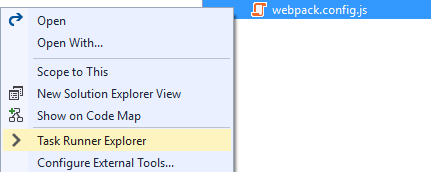
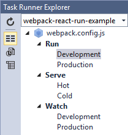
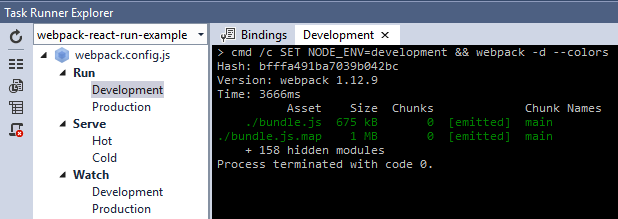
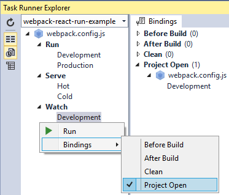
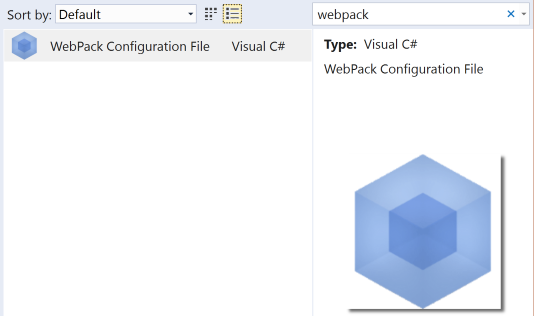

# WebPack Task Runner extension
Adds support for the [WebPack](https://webpack.github.io/)
build tool in Visual Studio 2015's Task Runner Explorer.

[](https://ci.appveyor.com/project/madskristensen/webpacktaskrunner)

Download the extension at the
[VS Gallery](https://visualstudiogallery.msdn.microsoft.com/5497fd10-b1ba-474c-8991-1438ae47012a)
or get the
[nightly build](http://vsixgallery.com/extension/471a020e-77f5-4c77-8ff0-59e08b6c5ba3/)

## Install WebPack
In order to use this extension, you must have
[WebPack](https://webpack.github.io/) installed globally or locally
in your project.

Use [npm](http://npmjs.org/) to install it globally by
typing the following in a command line:

>npm install webpack -g

To use the server functionality you also need to install
webpack-dev-server like so:

>npm install webpack-dev-server -g

If you wish to use babel to run WebPack, you must first
install it locally in your project:

>npm install babel-core --save-dev

## Config files
The WebPack Task Runner automatically triggers when it finds
WebPack configuration files. The following file names
are supported:

- webpack.config.js
- webpack.config.ts
- webpack.config.coffee
- webpack.config.babel.js

## Dev server
This extension support **webpack-dev-server** and can
invoke it through the Task Runner Explorer.

Make sure to set up the details in the webpack.config.js
file like so:

```js
devServer: {
    contentBase: '.',
    host: 'localhost',
    port: 9000
},
```

## Task Runner Explorer
Open Task Runner Explorer by right-clicking the WebPack
configuration file and select **Task Runner Explorer** from
the context menu:



Task Runner Explorer will show both _run_ and _watch_
tasks.



Each task can be executed by double-clicking the task.



### Switches
WebPack CLI switches are available on the left-hand
side toolbar. The switches are

1. --display-modules
2. --display-reasons
3. --display-chunks
4. --display-error-details


All switches are toggle button that can be left
on or off for as long as needed.

### Bindings
Task bindings make it possible to associate individual tasks
with Visual Studio events such as _Project Open_ etc.



### Item Template
You can easily add a new **webpack.config.js** file to
your project from the _Add New Item_ dialog.

Just search for "webpack".

