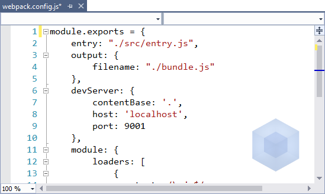

# WebPack Task Runner extension
Adds support for the [WebPack](https://webpack.github.io/)
build tool in Visual Studio 2015 and Visual Studio 2017's Task Runner Explorer.

[](https://ci.appveyor.com/project/madskristensen/webpacktaskrunner)

Download the extension at the
[VS Gallery](https://visualstudiogallery.msdn.microsoft.com/5497fd10-b1ba-474c-8991-1438ae47012a)
or get the
[nightly build](http://vsixgallery.com/extension/471a020e-77f5-4c77-8ff0-59e08b6c5ba3/)

## New to WebPack?
You may want to check out the article
[How to integrate WebPack into Visual Studio 2015](http://www.sochix.ru/how-to-integrate-webpack-into-visual-studio-2015/)
by [Ilya Pirozhenko](https://twitter.com/SochiX), which applies equally to VS2017.

## Install WebPack
In order to use this extension, you must have
[WebPack](https://webpack.github.io/) installed globally or locally
in your project.

Use [npm](http://npmjs.org/) to install it globally by
typing the following in a command line:

>`npm install webpack -g`

To use the server functionality you also need to install
[webpack-dev-server](http://webpack.github.io/docs/webpack-dev-server.html)
like so:

>`npm install webpack-dev-server -g`

If you wish to use [babel](https://babeljs.io/)
to run WebPack, you must first install it locally in your project:

>`npm install babel-core --save-dev`

## Config files
The WebPack Task Runner automatically triggers when it finds
WebPack configuration files. The following file names
are supported:

- webpack.config.js
- webpack.config.ts
- webpack.config.coffee
- webpack.config.babel.js

**Important!** The Task Runner Explorer requires the config files to
be located at the root of the project or solution - not in a project
sub folder.

Any config file will have a WebPack logo watermark at
the bottom right corner of the editor window.



You can toggle the visibility of the watermark by clicking
on it.

## Dev server
This extension supports **webpack-dev-server** and can
invoke it through the Task Runner Explorer.

Make sure to setup the details in the **webpack.config.js**
file like so:

```js
devServer: {
    contentBase: ".",
    host: "localhost",
    port: 9000
},
```

## Task Runner Explorer
Open Task Runner Explorer by right-clicking the WebPack
configuration file and selecting **Task Runner Explorer** from
the context menu:


The following tasks are supported:

- **Run**
  - Run - Development: `webpack -d --color`
  - Run - Production: `webpack -p --color`
- **Profile**
  - Profile - Development: `webpack -d --profile --json > stats.json`
  - Profile - Production: `webpack -p --profile --json > stats.json`
- **Serve**
  - Hot: `webpack-dev-server --hot`
  - Cold: `webpack-dev-server`
- **Watch**
  - Watch - Development: `webpack -d --watch --color`
  - Watch - Production: `webpack -p --watch --color`


Each task can be executed by double-clicking the task.


### Switches
WebPack CLI switches are available on the left-hand
side toolbar. The switches are:

1. --display-modules
2. --display-reasons
3. --display-chunks
4. --display-error-details
5. --bail
6. --inline


Each switch enabled will be added to the arguments when invoking
the WebPack CLI.

>The `--progress` switch is **not** supported in this extension
>due to Task Runner Explorer's inability to handle it.

All switches are toggle buttons that can be left
on or off for as long as needed.

### Development / Production
When executing a Production task, the extension will automatically
set `NODE_ENV` to *production*. For Development tasks,
*development* will be the value.

`SET NODE_ENV=production&& webpack...`

### Bindings
Task bindings make it possible to associate individual tasks
with Visual Studio events such as _Project Open_ etc.


## Item Template
You can easily add a new **webpack.config.js** file to
your project from the _Add New Item_ dialog.

Just search for "webpack".


## License
[Apache 2.0](LICENSE)
